### 测试说明

- 本项目采用了两款开源的HTTP压力测试工具“wrk”和“WebBench”进行测试
- 测试方法
  - 模拟1000条TCP连接，持续时间60s
  - 测试长连接情况
  - 考虑到磁盘IO的影响，分别对有/无磁盘IO影响两种情况做测试，测试时服务器的响应报文分别为:
    保存到内存中的HTTP报文（无磁盘IO影响）、HTTP报头+读取磁盘的lgy2one.html网页（有磁盘IO影响）
- 测试环境（虚拟机环境下测试，性能可能较物理机低）
  - CPU: Intel(R) Core(TM) i5-7300HQ CPU @ 2.50GHz
  - Memory: 2G
  - VirtualBox： VMvare 15
  - OS: CentOS 7
  - Core Number: 4

### 测试结果

#### 单线程：

wrk测试结果：（IO）1.9万+QPS、CPU占用率8%+

WebBench测试结果：（内存）2万+QPS、（IO）1.4万+QPS、CPU占用率8%+

#### 1+4线程：

wrk测试结果：（IO）5.3万+QPS、CPU占用率46%+

WebBench测试结果：（内存）4.8万+QPS、（IO）3.5万+QPS、CPU占用率30%+

#### 1+6线程：

wrk测试结果：（IO）6.6万+QPS、CPU占用率71%+

WebBench测试结果：（内存）6.1万+QPS、（IO）4.6万+QPS、CPU占用率70%+

#### 加测：

wrk 12线程 1500连接数：8.6万qps，CPU占用率80%+，外部CPU使用率已接近100%

### 单线程测试 

**执行命令：./httpserver 80 0 0**

- **wrk测试结果：（IO）1.9万+QPS**
  - **index.html网页（有磁盘IO影响）**

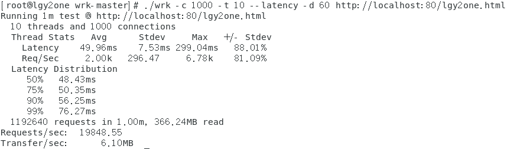

CPU情况：

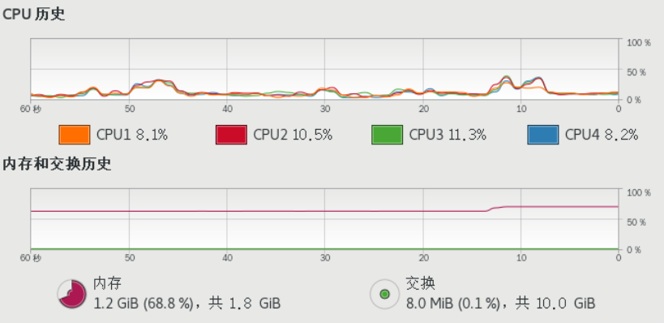

- **WebBench测试结果：（内存）2万+QPS、（IO）1.4万+QPS**
  - **内存中的HTTP报文（无磁盘IO影响）**

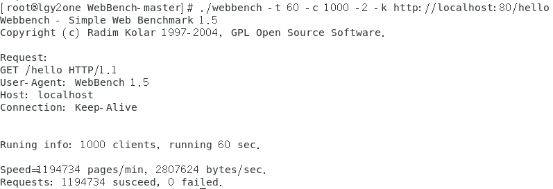

CPU情况：

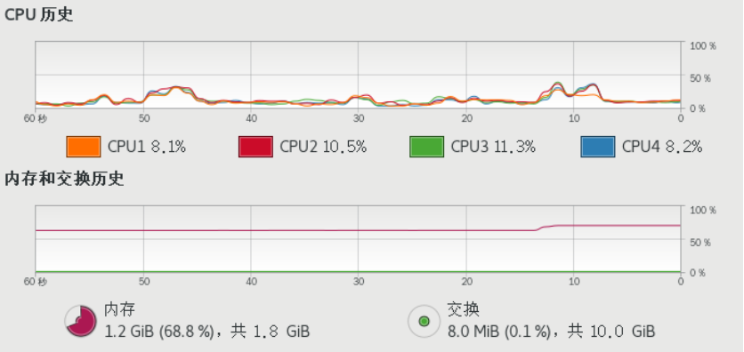

- **index.html网页（有磁盘IO影响）**

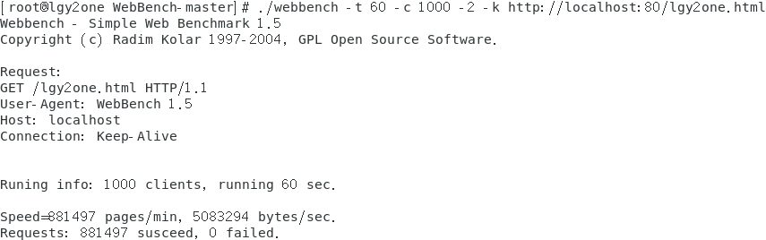

CPU情况：

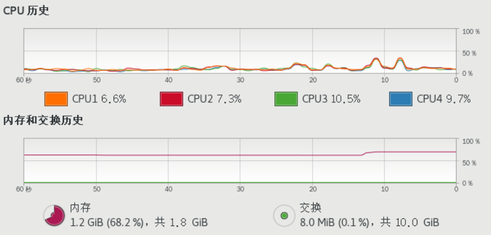

### 多线程测试1 

**4个IO线程 执行命令：./httpserver 80 4 0**

- **wrk测试结果：（IO）5.3万+QPS**
  - **index.html网页（有磁盘IO影响）**

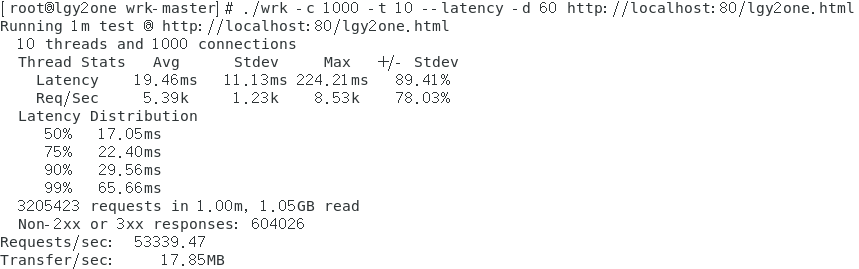

CPU情况：

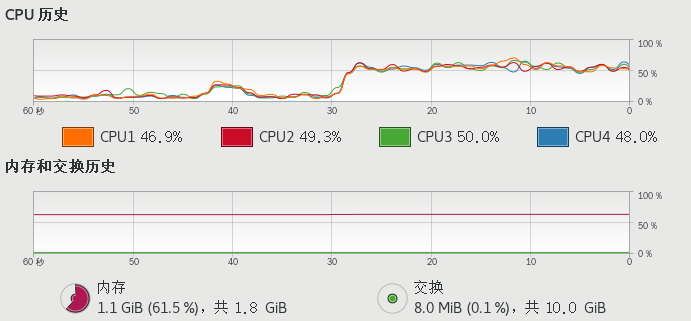

- **WebBench测试结果：（内存）4.8万+QPS、（IO）3.5万+QPS**
    - **内存中的HTTP报文（无磁盘IO影响）**

CPU情况：

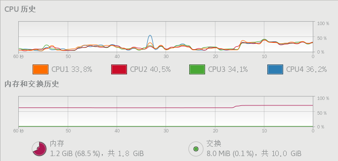

- **index.html网页（有磁盘IO影响）**

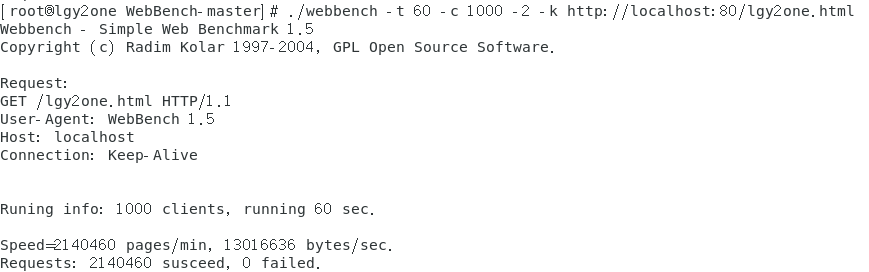

CPU情况：

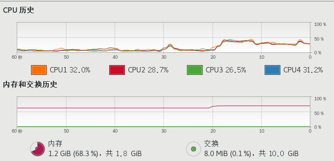

### 多线程测试2 

**4个IO线程 2个工作线程 执行命令：./httpserver 80 4 2**

- **wrk测试结果：（IO）6.6万+QPS**
  - **index.html网页（有磁盘IO影响）**

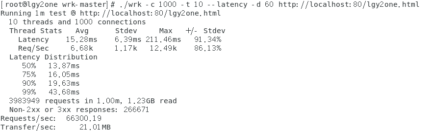

CPU情况：

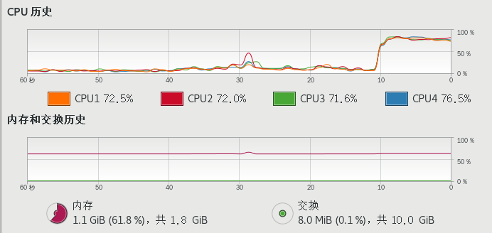

- **WebBench测试结果：（内存）6.1万+QPS、（IO）4.6万+QPS**
    - **内存中的HTTP报文（无磁盘IO影响）**

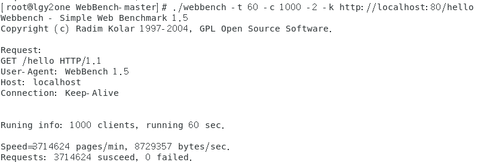

CPU情况：

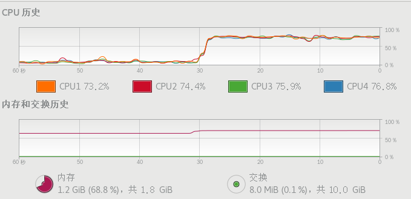

- **index.html网页（有磁盘IO影响）**

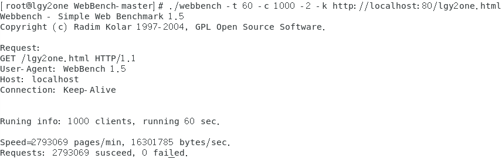

CPU情况：

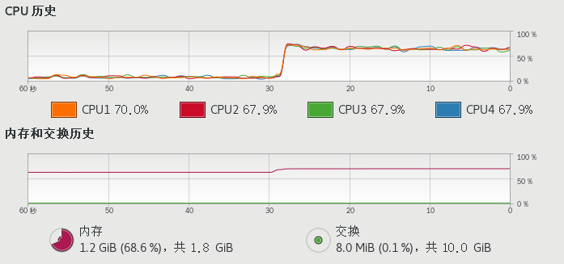

- **开启12个线程，1500个连接对服务器进行测试**

​        因为发现CPU利用率还不到最高的程度，推测还没有到达服务器瓶颈，因此再加大进程数和连接数进行测试。

**测试结果：8.6万qps，CPU占用率80%+，外部CPU使用率已接近100%**

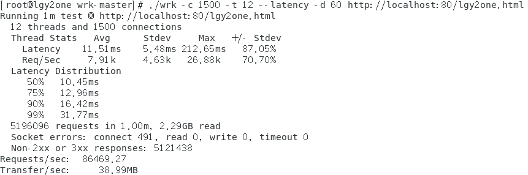

CPU情况：

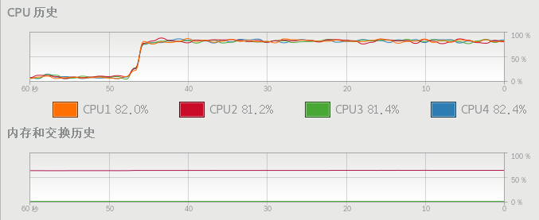

